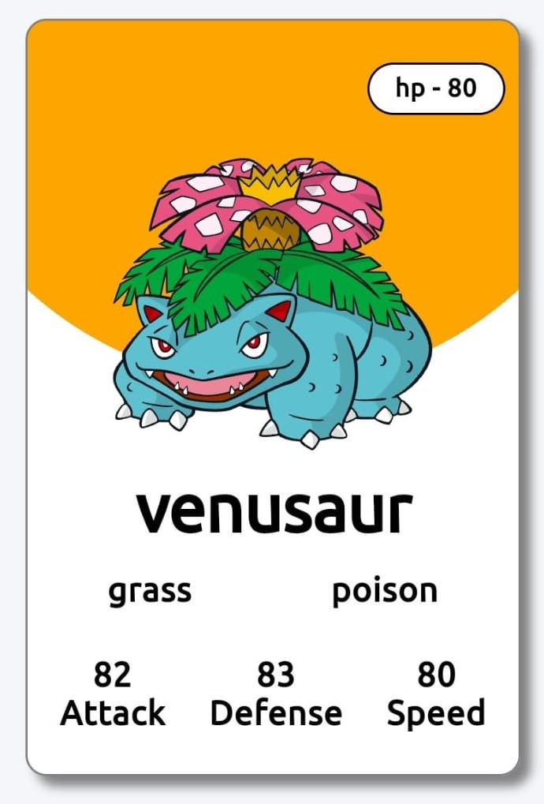

# Pokemon Card Generator 🌟

Welcome to the Pokemon Card Generator project! 🌈

# Visit Project 🔗🌐

https://github.com/Manishak798/Pokemon-card-genrator-/assets/90680330/b79f7b08-3e02-4be6-a69d-85100e0f9d39

https://manishak798.github.io/Pokemon-card-genrator-/

This project allows users to generate random Pokemon cards using HTML, CSS, and JavaScript. The data for the Pokemon cards is sourced from the Poke API, providing a diverse range of Pokemon to discover.

## Features:
- **Random Card Generation:** Create unique Pokemon cards with a simple click. 🃏
- **HTML, CSS, JS:** Developed using fundamental web technologies. 💻
- **Poke API Integration:** Get real Pokemon data to populate the cards. 📡

## How to Use:
1. Open the project in your preferred browser.
2. Click the "Generate" button to get a random Pokemon card. 🔄
3. Explore the details and enjoy the diverse Pokemon collection. 🌐

Feel free to contribute, report issues, or suggest improvements. Happy Pokemon card generating! 🎉

**Tech Stack:**
- HTML
- CSS
- JavaScript
- Poke API

**Author:** Manisha kundnani 👩‍💻

**Contribution:** Contributions are welcome! Feel free to open issues and pull requests. 🤝

## Project Img

